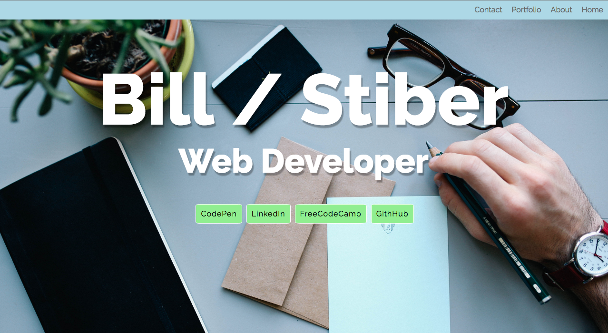

# 1stPortfolioWebsite
FreeCodeCamp Website Portfolio 
This is an exercise in the Front-end Development track at http://FreeCodeCamp.com. This is one of the many projects that are required to complete the front-end development certification.  This project was solely designed using only html and CSS, no frameworks such as bootstrap were allowed.  This is pure code and hard work, no short cuts here.

View the updated completed project on codepen: http://codepen.io/bstiber/full/EKdBPx/.

Thanks for visiting!

